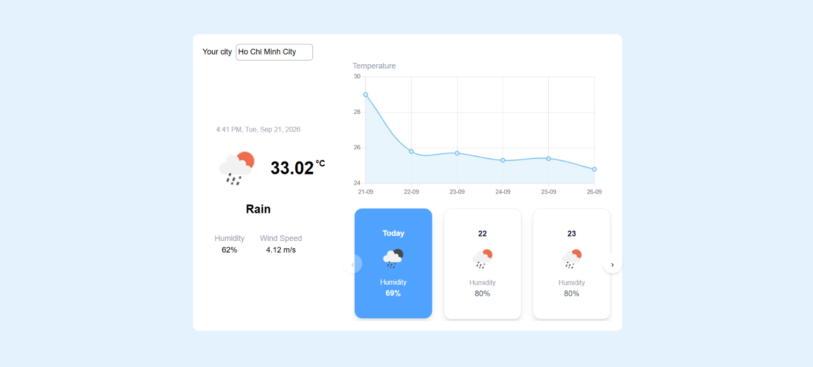

# DevProjects - Weather forecast website

This is an open source project from [DevProjects](http://www.codementor.io/projects). Feedback and questions are welcome!
Find the project requirements here: [Weather forecast website](https://www.codementor.io/projects/web/weather-forecast-website-atx32lz7zb)

## Tech/framework used

Built with React and OpenWeather api

## Screenshots and demo



## Installation

This project is a weather web application that provides current weather information and weather forecasts based on the user's device location. It uses the OpenWeather API to retrieve weather data.

### Prerequisites

Make sure you have the following installed:

- Node.js
- npm
- Git

### Installation

1. Clone the repository:

````bash
git clone <repository-url>

cd <project-folder>

npm install

### API Configuration

Create a `.env` file in the root directory and add your OpenWeather API key:

```env
VITE_OPENWEATHER_API_KEY=your_api_key

Make sure `.env` is included in `.gitignore`.

### Run the Application

Start the development server:

```bash
npm run dev
## License

````
